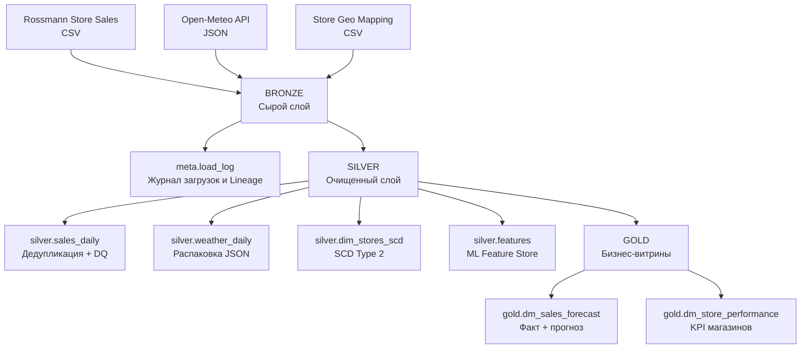
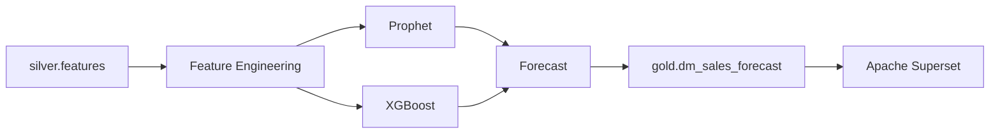

# ROSSMANN FORECAST

### Прогнозно-аналитическая система управления спросом

> Проект разработан в рамках дисциплины **«Прогнозно-аналитические системы»** для профиля **«Управление данными»**.

|                |                                 |
| -------------- | ------------------------------- |
| **Студент**    | Оржевская Лилия Борисовна       |
| **Группа**     | ИНБО-21-23                      |
| **Дисциплина** | Прогнозно-аналитические системы |
| **Профиль**    | Управление данными              |
| **Дата**       | Сентябрь 2026 г.                |

---

## 📌 О проекте

**ROSSMANN FORECAST** — прогнозно-аналитическая система управления спросом, реализующая полный цикл работы с данными: от автоматизированного сбора из разнородных источников до очистки, преобразования, контроля качества, историзации и формирования аналитических витрин.

Основное внимание в проекте уделено принципам **Data Lifecycle Management**:

* 🔗 прослеживаемость происхождения данных (**Data Lineage**);
* 🛡️ устойчивость конвейера к сбоям;
* ♻️ идемпотентность операций;
* 📋 ведение журнала загрузок;
* 🧹 контроль качества данных;
* 🕐 историзация изменений;
* 🔄 воспроизводимость всего процесса обработки.

### 🎯 Основной прогнозируемый показатель

> **Суточный объём продаж (`Sales`, €) в разрезе магазина (`Store`) на горизонте 6 недель.**

---

## 🏪 Предметная область и постановка задачи

### Бизнес-проблема

Розничные сети ежедневно сталкиваются с двумя ключевыми рисками:

| Риск             | Описание                   | Последствия                                 |
| ---------------- | -------------------------- | ------------------------------------------- |
| **Out-of-stock** | Отсутствие товара на полке | Упущенная выручка                           |
| **Overstock**    | Избыточные запасы          | Рост списаний и заморозка оборотных средств |

Для сети из **1115 магазинов** ручное планирование спроса становится неэффективным.

Поэтому система должна формировать прогноз продаж на основе:

* исторических данных о продажах;
* характеристик магазинов;
* погодных условий;
* внешних факторов;
* дополнительных признаков, подготовленных в процессе ETL/ELT.

### 👥 Целевые пользователи

| Пользователь                          | Интерфейс            | Основные задачи                                                             |
| ------------------------------------- | -------------------- | --------------------------------------------------------------------------- |
| **Операционный директор сети**        | Предметный дашборд   | Анализ прогноза продаж по регионам и форматам магазинов, выявление рисков   |
| **Дежурный аналитик / Data Engineer** | Операционный дашборд | Мониторинг состояния конвейера, статусов загрузок, качества данных и ошибок |

---

## 📊 Источники данных

В системе используются **3 источника**, включая **2 разнородных внешних источника**, различающихся по способу получения и формату данных.

| Источник                          | Тип        | Формат | Частота                     | Назначение                                      |
| --------------------------------- | ---------- | ------ | --------------------------- | ----------------------------------------------- |
| **Rossmann Store Sales (Kaggle)** | Batch      | CSV    | Однократно + инкрементально | Исторические продажи за 2013–2015 гг.           |
| **Open-Meteo Historical API**     | REST API   | JSON   | Инкрементально              | Погодные данные как внешний фактор спроса       |
| **Store Geo Mapping**             | Справочник | CSV    | Однократно                  | Обогащение данных координатами городов Германии |

### Rossmann Store Sales

* Источник: Kaggle.
* Период: **2013–2015 гг.**
* Объём: около **1 млн строк**.
* Формат: CSV.
* Основная ценность: наличие временной компоненты и исторических данных о продажах.

### Open-Meteo Historical API

Погодные данные используются в качестве внешнего фактора, способного влиять на потребительский спрос.

Например:

* повышение температуры может влиять на структуру и объём продаж;
* дождливая погода может изменять покупательское поведение.

### Store Geo Mapping

Справочник используется для географического обогащения данных.

Привязка магазинов к координатам городов Германии является **синтетической** и используется исключительно для целей проекта.

> Все источники являются общедоступными либо синтетически сгенерированными. **Персональные данные не используются.**

---

# 🏗️ Архитектура системы

В проекте реализована **слоистая Medallion Architecture** с явным разделением ответственности между схемами PostgreSQL.



## 🥉 Bronze — сырой слой

Назначение: сохранение данных максимально близко к исходному виду.

| Таблица              | Назначение                                 |
| -------------------- | ------------------------------------------ |
| `bronze.raw_sales`   | Сырые данные о продажах в формате `JSONB`  |
| `bronze.raw_stores`  | Сырые данные о магазинах в формате `JSONB` |
| `bronze.raw_weather` | Сырые данные о погоде в формате `JSONB`    |

---

## 🥈 Silver — очищенный слой

На этом уровне выполняются очистка, дедупликация, контроль качества, историзация и подготовка признаков.

| Таблица                 | Назначение                            |
| ----------------------- | ------------------------------------- |
| `silver.sales_daily`    | Очищенные и дедуплицированные продажи |
| `silver.weather_daily`  | Распакованные погодные данные         |
| `silver.dim_stores_scd` | Историзация магазинов по SCD Type 2   |
| `silver.features`       | Витрина признаков для ML              |

---

## 🥇 Gold — бизнес-витрины

Финальный слой предназначен для аналитики и последующего подключения BI-инструментов.

| Таблица                     | Назначение                               |
| --------------------------- | ---------------------------------------- |
| `gold.dm_sales_forecast`    | Фактические значения + прогноз           |
| `gold.dm_store_performance` | KPI и показатели эффективности магазинов |

---

## 🧰 Технологический стек

| Компонент              | Технология                      | Назначение                                                   |
| ---------------------- | ------------------------------- | ------------------------------------------------------------ |
| **Хранилище**          | PostgreSQL 15                   | Транзакционное хранение, JSONB, DQ-контроль, оконные функции |
| **Контейнеризация БД** | Docker                          | Изолированный и воспроизводимый запуск PostgreSQL            |
| **Обработка**          | Python 3.11 + SQL               | ETL/ELT и трансформация данных                               |
| **Подключение к БД**   | `psycopg2`                      | Интеграция Python с PostgreSQL                               |
| **Зависимости**        | `venv` + `requirements.txt`     | Изоляция и воспроизводимость окружения                       |
| **Конфигурация**       | Python constants / dictionaries | Хранение параметров БД и API                                 |
| **SQL-клиент**         | DBeaver                         | Выполнение SQL, отладка и анализ данных                      |

---

# 🚀 Быстрый старт

## Предварительные требования

Перед запуском убедитесь, что установлены:

* [Docker Desktop](https://www.docker.com/products/docker-desktop/)
* Python **3.11+**
* DBeaver или любой другой SQL-клиент

---

## 1. Запуск PostgreSQL

Запустите контейнер:

```bash
docker run --name rossmann_db \
  -e POSTGRES_USER=rossmann \
  -e POSTGRES_PASSWORD=rossmann \
  -e POSTGRES_DB=rossmann \
  -p 5432:5432 \
  -d postgres:15
```

После запуска PostgreSQL будет доступен по адресу:

| Параметр | Значение    |
| -------- | ----------- |
| Host     | `localhost` |
| Port     | `5432`      |
| Database | `rossmann`  |
| User     | `rossmann`  |
| Password | `rossmann`  |

---

## 2. Настройка Python-окружения

Создайте виртуальное окружение:

```bash
python3.11 -m venv venv
```

Активируйте его:

### Linux / macOS

```bash
source venv/bin/activate
```

### Windows

```powershell
venv\Scripts\activate
```

Установите зависимости:

```bash
pip install -r requirements.txt
```

---

## 3. Инициализация базы данных

Подключитесь к PostgreSQL через DBeaver:

```text
Host:     localhost
Port:     5432
Database: rossmann
User:     rossmann
Password: rossmann
```

Затем выполните:

```text
sql/init_db.sql
```

Скрипт создаёт необходимые схемы и таблицы проекта.

---

## 4. Подготовка исходных данных

Скачайте следующие файлы с Kaggle:

```text
train.csv
store.csv
```

Поместите их в директорию:

```text
data/raw/
```

Ожидаемая структура:

```text
data/
└── raw/
    ├── train.csv
    └── store.csv
```

---

## 5. Запуск конвейера загрузки

Выполните Python-скрипты:

```bash
python scripts/generate_geo.py
python scripts/loader.py
python scripts/load_stores.py
python scripts/load_weather.py
python scripts/load_store_region_mapping.py
```

На этом этапе выполняется загрузка исходных данных в слой **Bronze** и формируется необходимая дополнительная информация.

---

## 6. Выполнение SQL-трансформаций

SQL-скрипты из директории `sql/` необходимо запускать **строго в указанном порядке**:

```text
sql/
├── transform_sales_to_silver.sql
├── transform_weather_to_silver.sql
├── transform_stores_scd2.sql
├── transform_features.sql
└── transform_gold.sql
```

Порядок выполнения:

```text
1. transform_sales_to_silver.sql
2. transform_weather_to_silver.sql
3. transform_stores_scd2.sql
4. transform_features.sql
5. transform_gold.sql
```

---


# 🔍 Проверка результатов

## 1. Проверка журнала загрузок и Lineage

Для просмотра истории загрузок выполните:

```sql
SELECT
    source_name,
    status,
    rows_loaded,
    rows_rejected,
    config_snapshot
FROM meta.load_log
ORDER BY load_id DESC;
```

Журнал позволяет контролировать:

* источник данных;
* статус загрузки;
* количество загруженных строк;
* количество отбракованных строк;
* конфигурацию загрузки;
* историю выполнения конвейера.

---

## 2. Проверка количества записей по слоям

```sql
SELECT
    'bronze.raw_sales' AS layer,
    COUNT(*) AS rows
FROM bronze.raw_sales

UNION ALL

SELECT
    'silver.sales_daily',
    COUNT(*)
FROM silver.sales_daily

UNION ALL

SELECT
    'silver.dim_stores_scd',
    COUNT(*)
FROM silver.dim_stores_scd

UNION ALL

SELECT
    'silver.features',
    COUNT(*)
FROM silver.features

UNION ALL

SELECT
    'gold.dm_store_performance',
    COUNT(*)
FROM gold.dm_store_performance;
```


---

# 🔗 Data Lineage

Для обеспечения прослеживаемости данных используется идентификатор:

```text
load_batch_id
```

Он позволяет связать данные между слоями:

```text
Source
  ↓
Bronze
  ↓
Silver
  ↓
Gold
```

Дополнительная информация о каждой загрузке сохраняется в:

```text
meta.load_log
```

Таким образом, можно определить:

* когда была выполнена загрузка;
* какой источник использовался;
* сколько строк было загружено;
* сколько строк было отклонено;
* с какой конфигурацией выполнялась загрузка;
* к какому batch относится конкретная запись.

---

# 🕐 Историзация данных

Для историзации измерения магазинов используется **SCD Type 2**.

Таблица:

```text
silver.dim_stores_scd
```

Основные атрибуты:

| Поле         | Назначение                            |
| ------------ | ------------------------------------- |
| `valid_from` | Дата начала действия версии записи    |
| `valid_to`   | Дата окончания действия версии записи |
| `is_current` | Признак актуальной версии             |

Это позволяет сохранять историю изменений характеристик магазинов, не теряя предыдущие значения.

---

# 🛡️ Контроль качества данных

В системе реализовано несколько уровней контроля качества:

### На уровне базы данных

Используются `CHECK`-ограничения, например:

```sql
CHECK (sales >= 0)
```

### На уровне SQL-трансформаций

Применяются:

* `WHERE`-фильтры;
* дедупликация;
* обработка пропусков;
* отбраковка некорректных значений.

### На уровне Python

Предусмотрены:

* обработка исключений;
* `rollback` транзакций;
* обработка ошибок API;
* обработка таймаутов;
* логирование результатов загрузок.

---

# 🔄 Идемпотентность

Повторный запуск конвейера не должен приводить к неконтролируемому дублированию данных.

Для этого используются:

```sql
ON CONFLICT DO NOTHING
```

и уникальные ограничения на ключевых сущностях.

Таким образом, одна и та же загрузка может быть повторно выполнена без создания дубликатов.

---

# 🔮 Future Work

В текущем этапе реализован полнофункциональный прототип **ядра данных**.

В следующих итерациях планируется расширение системы.

| Направление                 | Планируемая реализация                                                                |
| --------------------------- | ------------------------------------------------------------------------------------- |
| **Оркестрация**             | Перенос Python-скриптов в DAG-и Apache Airflow, настройка расписания и retry-политики |
| **Потоковые данные**        | Реализация Stream-источника на базе Redpanda + генератора транзакций                  |
| **Прогнозное ядро**         | Обучение моделей Prophet и XGBoost на витрине `silver.features`                       |
| **Визуализация**            | Подключение Apache Superset к слою Gold                                               |
| **Операционный мониторинг** | Дашборд состояния загрузок, качества данных и ошибок                                  |

### Планируемый ML-контур



---

# 📄 Лицензия и источники данных

### Rossmann Store Sales

Открытое соревнование Kaggle. Используется для учебных и исследовательских целей в рамках проекта.

### Open-Meteo

Открытые исторические метеорологические данные.

Лицензия: **CC BY 4.0**.

### Store Geo Mapping

Синтетически сгенерированный справочник на основе открытых координат городов Германии.

> **Персональные данные в проекте не используются.**

---

# 👩‍💻 Автор

**Оржевская Лилия Борисовна**

|                |                                 |
| -------------- | ------------------------------- |
| **Группа**     | ИНБО-21-23                      |
| **Дисциплина** | Прогнозно-аналитические системы |
| **Профиль**    | Управление данными              |
| **Дата**       | Сентябрь 2026 г.                |

---

<p align="center">
  <b>ROSSMANN FORECAST</b><br>
  Прогнозно-аналитическая система управления спросом
</p>
